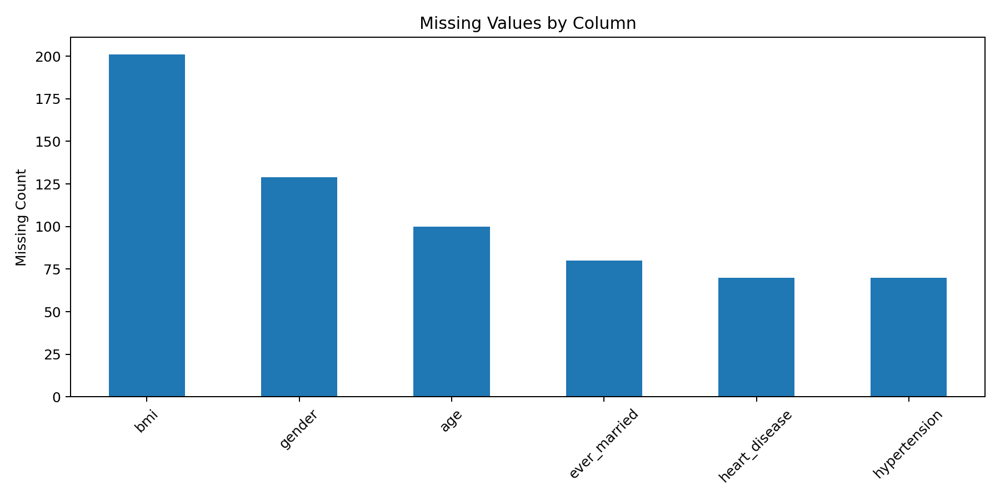
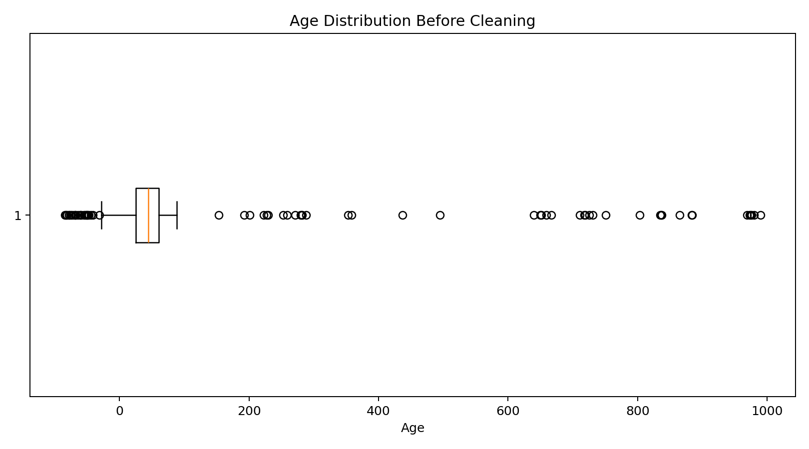
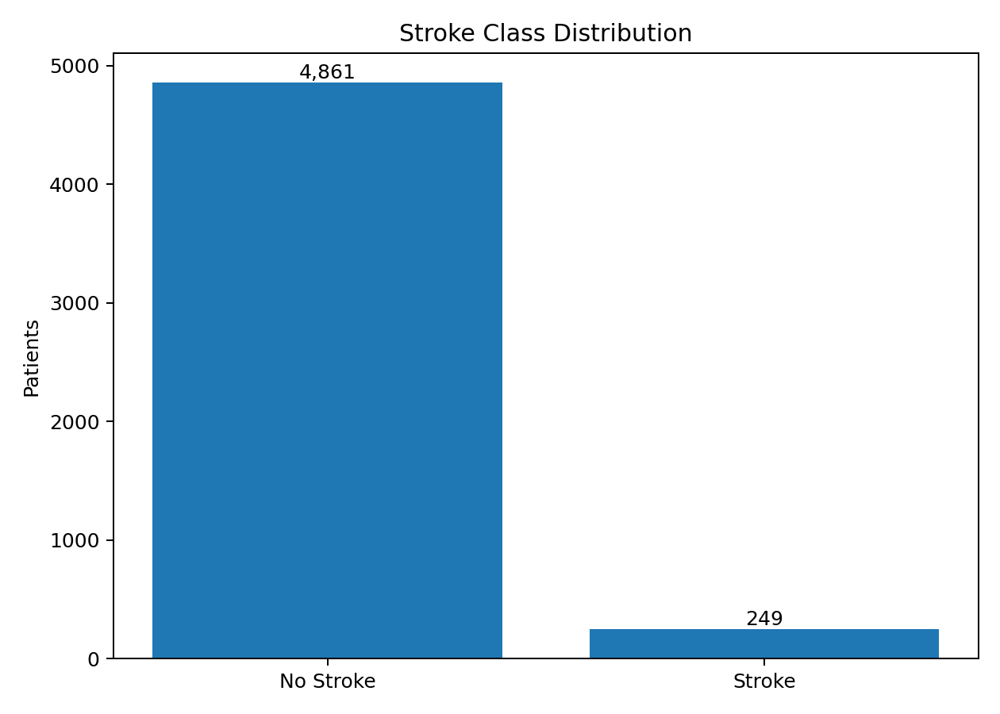
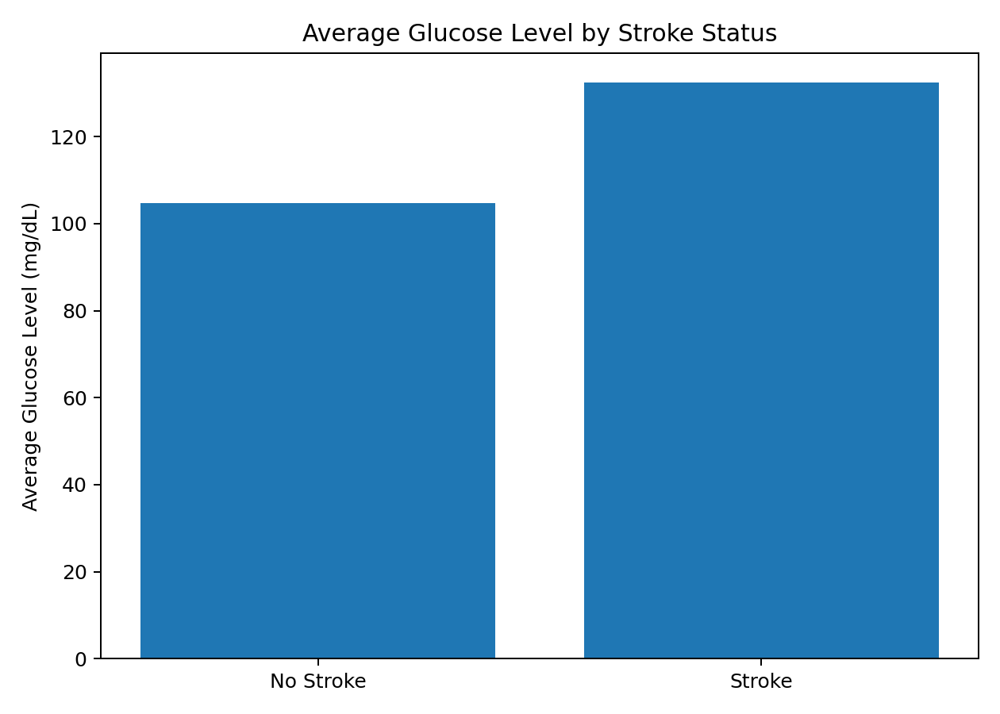
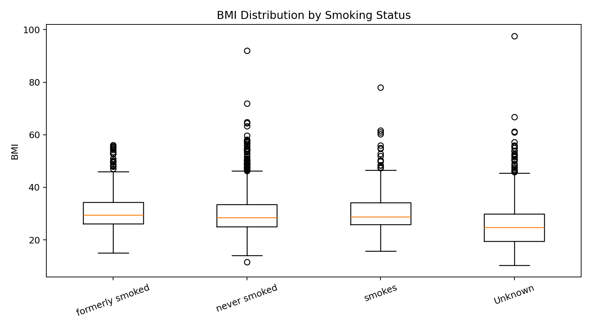
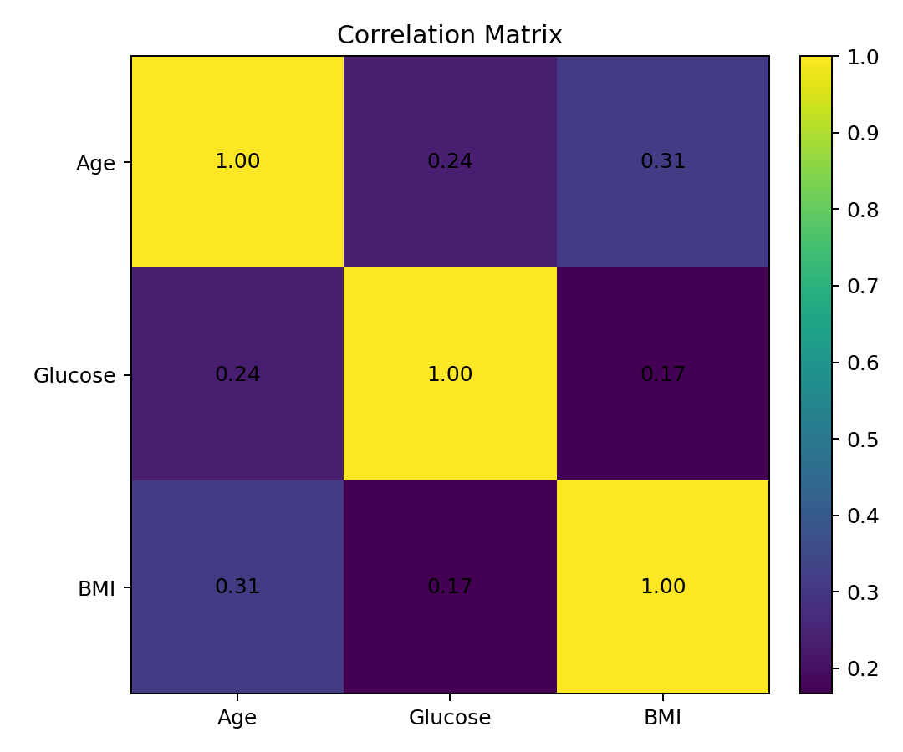

# Data Science - Stroke Data Cleaning Preprocessing EDA

A **Data Science** project for cleaning, preprocessing, and performing **Exploratory Data Analysis (EDA)** on a Stroke Prediction Dataset using **R**.

## Features

- Data Inspection
- Missing Value Analysis
- Duplicate Detection
- Inconsistent Data Handling
- Invalid Value Correction
- Age Outlier Detection
- Mode & Median Imputation
- Data Type Conversion
- Min-Max Normalization
- Data Filtering
- Descriptive Statistics
- Group Analysis
- Correlation Analysis
- Data Visualization
- Clean Dataset Export

## Technologies

- R
- RStudio
- readr
- dplyr
- Base R Statistics
- Base R Visualization

## Project Structure

```text
DataScience-Stroke-Data-Cleaning-Preprocessing-EDA/
│
├── Code/
│   ├── Stroke_Data_Cleaning_Preprocessing_EDA.R
│   └── Stroke_Data_Cleaning_Preprocessing_EDA.Rproj
│
├── DataSet/
│   ├── Stroke_Dataset_Dirty.csv
│   └── Stroke_Dataset_Clean.csv
│
├── Documentation/
│   └── Stroke_Data_Cleaning_EDA_Report.pdf
│
├── Outputs/
│   ├── Figures/
│   └── Tables/
│
├── .gitignore
└── README.md
```

## Project Screenshots

### Missing Values



### Age Outliers



### Stroke Class Distribution



### Average Glucose by Stroke Status



### BMI by Smoking Status



### Correlation Matrix



## Dataset

The project uses a **5,110-record Stroke Prediction Dataset** containing:

- Patient ID
- Gender
- Age
- Hypertension
- Heart Disease
- Marital Status
- Work Type
- Residence Type
- Average Glucose Level
- BMI
- Smoking Status
- Stroke

The dirty dataset contains intentionally introduced data-quality problems such as missing values, inconsistent categories, invalid binary values, and age outliers.

## Data Cleaning & EDA

The project performs:

- Missing-value analysis
- Duplicate checking
- Category standardization
- Invalid-value handling
- Age outlier treatment
- Median/mode imputation
- Factor conversion
- Min-Max normalization
- High-risk subgroup filtering
- Descriptive statistics
- Stroke-group comparison
- BMI analysis by smoking status
- Correlation analysis

## How to Run

Install **R** and **RStudio**, then install the required packages:

```r
install.packages(c(
  "readr",
  "dplyr"
))
```

Open:

```text
Code/Stroke_Data_Cleaning_Preprocessing_EDA.Rproj
```

Then run:

```text
Code/Stroke_Data_Cleaning_Preprocessing_EDA.R
```

## Project Report

The complete academic report is available in:

```text
Documentation/Stroke_Data_Cleaning_EDA_Report.pdf
```

## Author

**Najiat Islam Rishad**

Computer Science & Engineering  
American International University-Bangladesh (AIUB)

GitHub: https://github.com/munshi-rishad

## GitHub

Repository name:

```text
DataScience-Stroke-Data-Cleaning-Preprocessing-EDA
```

Push the project:

```bash
git init
git add .
git commit -m "Initial commit"
git branch -M main
git remote add origin https://github.com/munshi-rishad/DataScience-Stroke-Data-Cleaning-Preprocessing-EDA.git
git push -u origin main
```
